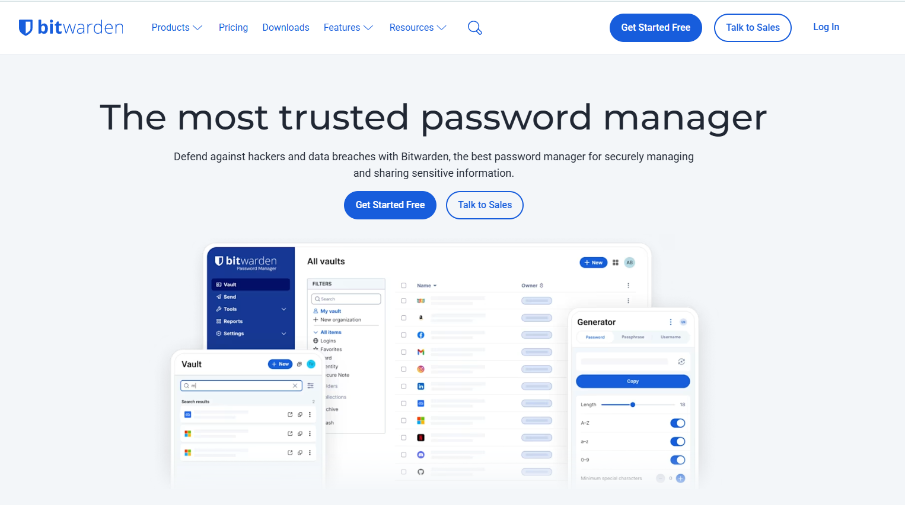
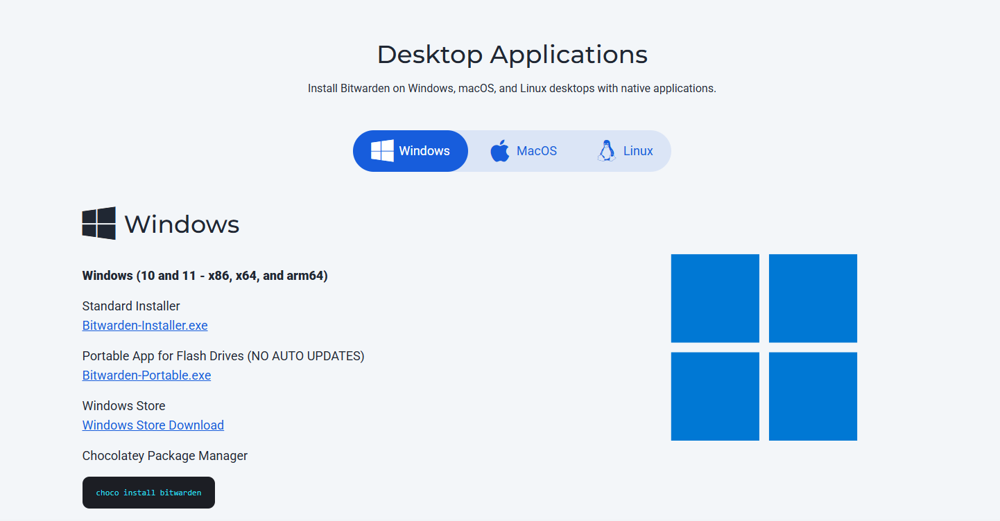
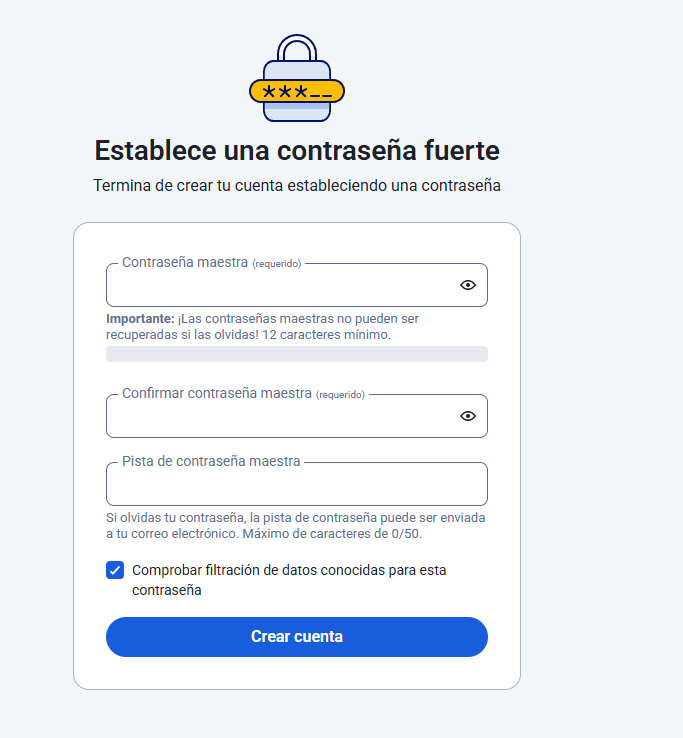

# Gestor de contrasenyes: Bitwarden

En aquesta guia, es mostraran les pautes per instal·lar **Bitwarden**.

## 1. Descarregar Bitwarden

Descarrega Bitwarden des de la seva pàgina principal fent clic a **Download**.  

Selecciona el sistema operatiu que tinguin els teus dispositius.

## 2. Executar l’aplicació

En executar l’aplicació, fes clic a **Crear compte nou**.  
Apareixerà un menú on hauràs d’introduir el teu **correu electrònic** i el **nom d’usuari** que vulguis.

Seguidament, rebràs un correu per verificar el teu compte de Gmail.

Un cop verificat, introdueix la **contrasenya mestra**.  
*Apunta-la en una memòria USB o guarda-la en un lloc segur que puguis recordar.*

## 3. Obrir l’aplicació

Un cop dins de l’aplicació, ja podràs afegir les teves contrasenyes fent clic al **+** de la part inferior dreta.

Introdueix:
- El **nom** que vols assignar.
- La **credencial del compte**.
- Altres dades necessàries.

---

## Extensió

### 1. Instal·lació

Per instal·lar l’extensió, torna a la pàgina de **Bitwarden** a la secció **Downloads** i tria l’opció per descarregar l’extensió segons el navegador que utilitzis.

Fes clic a **Free Account**  
i després a **Create Free Account**.

Introdueix el teu correu electrònic i verifica’l (encara que ja tinguis un compte creat).

Després:
1. Fes clic al **logo del puzle** de la part dreta del navegador.

2. Selecciona **Bitwarden**.

3. Inicia sessió amb el teu **correu** i **contrasenya mestra**.

5. Verifica amb el **codi enviat al teu correu principal**.

Ara ja podràs veure i guardar les teves contrasenyes.

## Extras

### 1. Com desar una credencial

Com s’ha indicat abans, fes clic al **+**  

Selecciona **Inici de sessió** 

i introdueix:
- El **nom del compte**
- La **contrasenya corresponent**

### 2. Com utilitzar l’extensió del navegador per emplenar automàticament les dades

Fes clic a **Utilitzar un altre compte**.

Després:
- Introdueix el teu **correu** (si cal, torna a escriure’l).
- Escriu la **contrasenya** i fes clic al **logo de la dreta**.
- Prem **Guardar en Bitwarden**.

Quan tornis a iniciar sessió, apareixerà el **nom** i la **contrasenya** guardats.  

Pots comprovar-ho iniciant sessió des de l’extensió.

### 3. Gestió de còpies de seguretat

Per fer-ho, inicia sessió a la **pàgina principal de Bitwarden**.  
Des del menú, selecciona:

1. **Eines** → **Exportar caixa forta**

3. Tria el format recomanat **.json**

L’arxiu s’exportarà a l’explorador d’arxius.  
Guarda’l en una **memòria USB** o **disc dur extern** per més seguretat.

---

### 4. Generador de contrasenyes

Per generar contrasenyes, ves al menú de la pàgina web i selecciona **Generador**.  
Podràs triar:
- La **longitud**
- El **tipus de caràcters**
- Altres paràmetres personalitzats

