# DISCS

## 1. Creació de la màquina (Captura 1)
El primer de tot serà crear la màquina amb els paràmetres inicials.

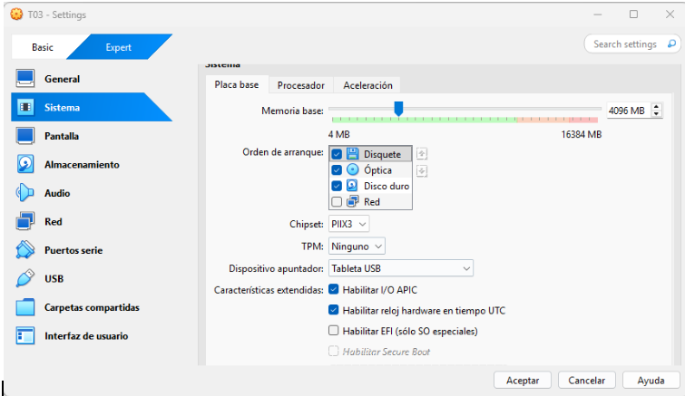

## 2. Configuració de l’espai (Captura 2)
Després entrarem a la configuració d'espai de la màquina.

## 3. Particions de disc (Captura 3)
On crearem les tres particions de disc amb **10 GB d’espai**.

## 4. Afegir particions (Captura 4)
I els afegirem.

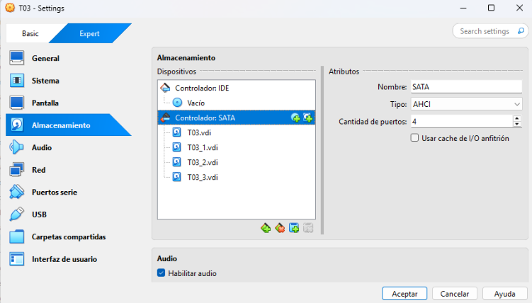

## 5. Muntatge dins la màquina (Captura 5)
Després entrarem a la màquina virtual i muntarem els 3 discos i un grup.

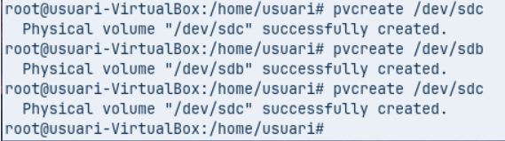

## 6. Comprovació d’estat (Captura 6)
Utilitzant aquesta comanda podrem comprovar l’estat dels discos.

## 7. Creació del grup de volums (Captura 7)
Crearem un **grup de volums** anomenat `lv01`.

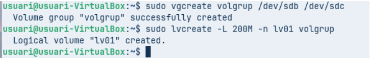

## 8. Format del VG (Captura 8)
Després formatem el VG per un sistema d'arxius.

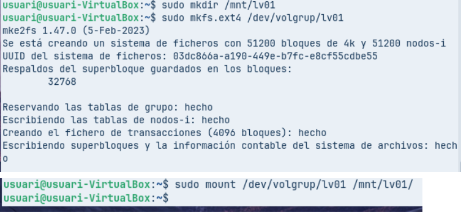

## 9. Muntatge permanent (Captura 9)
Després entrarem en aquest arxiu i el modificarem perquè estigui muntat permanentment.

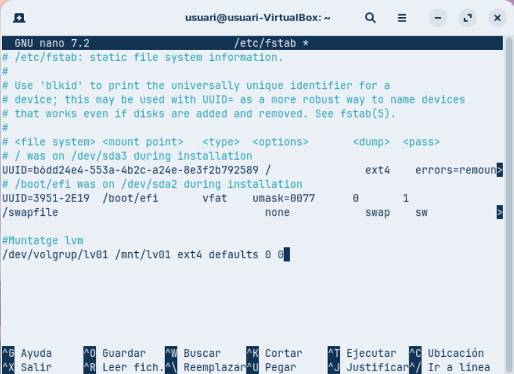

## 10. Comprovació addicional (Captura 10)
Aquesta comanda és simplement de comprovació.

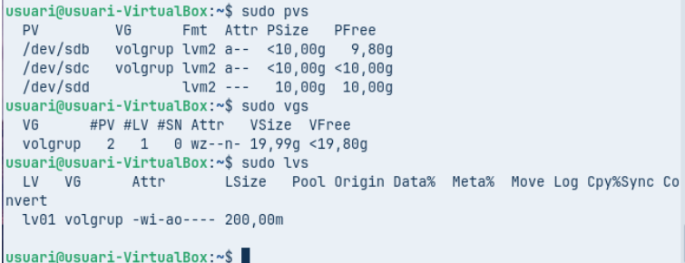

## 11. Alta disponibilitat (Captura 11)
Implementar la configuració d’un **mirall (lvm_mirror)** que protegeixi la informació davant la fallada d'un disc.

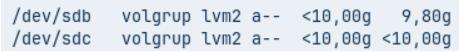

## 12. Creació del volum dades (Captura 12)
Crearem un altre volum anomenat **dades**.

## 13. Muntatge de dades (Captura 13)
Muntem la còpia.

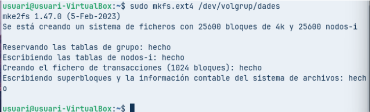

## 14. Arxiu dins dades (Captura 14)
Ara crearem un arxiu per posar-lo dins de *dades*.

## 15. Modificació de l’arxiu (Captura 15)
I tornem a modificar l’arxiu.

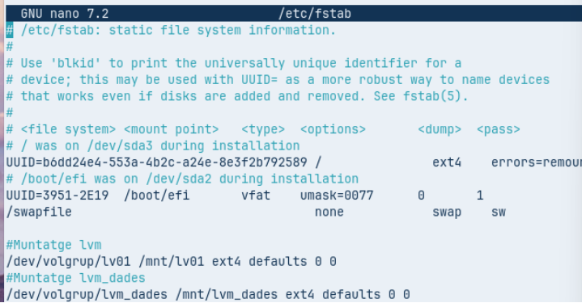

## 16. Creació del LV snapshot (Captura 16)
Crearem un altre LV que es dirà **snapshot**.

## 17. Replicació de l’estructura (Captura 17)
Crearem un altre cop l’estructura d’abans.

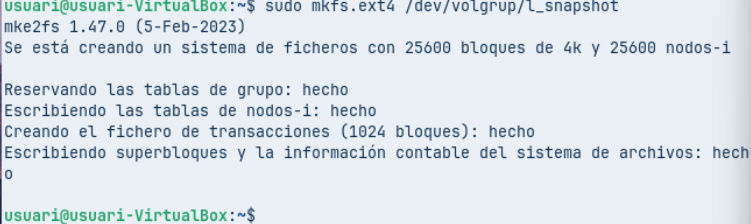

## 18. Modificació de l’arxiu (Captura 18)
Modificarem l'arxiu un altre cop.

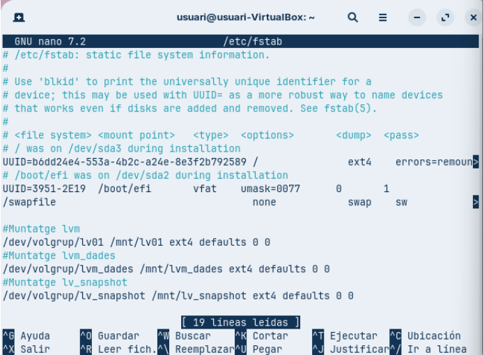

## 19. Arxiu dins snapshot (Captura 19)
Crearem un altre arxiu per posar-lo a *snapshot*.

## 20. Creació del LV copia (Captura 20)
Crearem un altre LV que es dirà **copia**, amb el mateix contingut que *snapshot*.

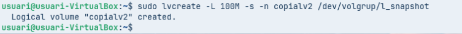

## 21. Escalabilitat (Captura 21)
Demostrarem el procés d'ampliació utilitzant l'espai lliure del grup de volums per **ampliar el volum dades**.

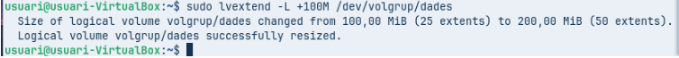

