# LDAP — Instal·lació i Configuració

A continuació es mostra el procés complet per instal·lar i configurar un servidor LDAP, la gestió amb LAM i la configuració d’un client Linux.

---

## 1. Configuració inicial del servidor

Primer configurem el nom de la màquina servidor, assignant:

- Hostname: `server`
- Nom complet: `server.innovatech07.test`

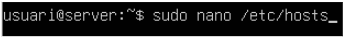

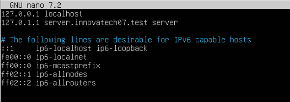

Després comprovem que el canvi s’ha aplicat correctament amb la comanda `hostname`.

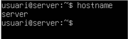

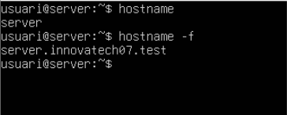

---

## 2. Configuració de xarxa

Configurem els adaptadors de xarxa:

- El primer en mode **NAT**
- El segon en mode **Només amfitrió**

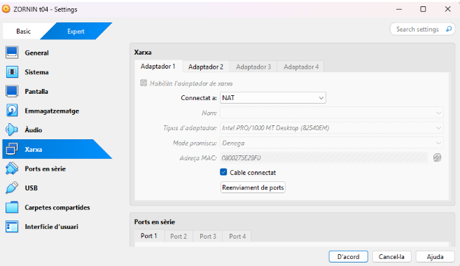

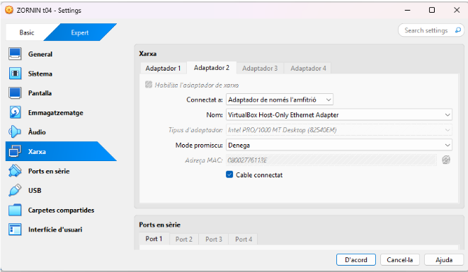

Habilitem els adaptadors editant l’arxiu de xarxa.

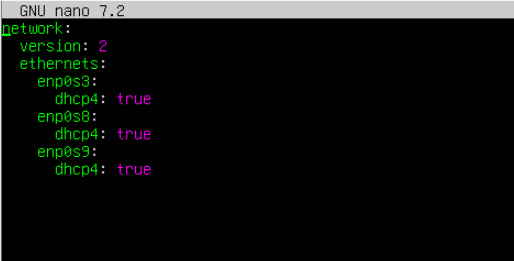

Comprovem les adreces IP.

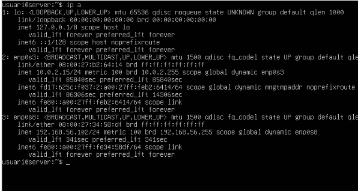

---

## 3. Instal·lació del servei LDAP

Instal·lem el servei LDAP.

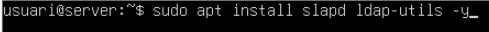

Comprovem l’estat del servei.

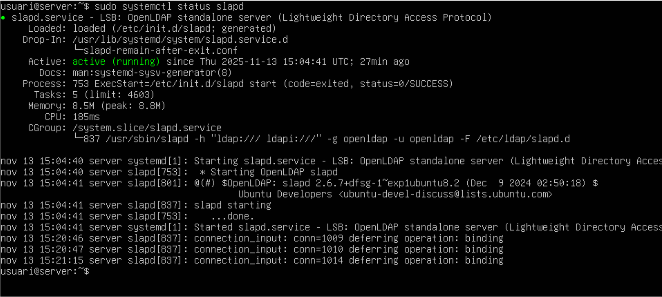

Despres configurem la base de dades del paquet

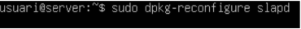

Seleccionem que **no volem ometre la configuració**.

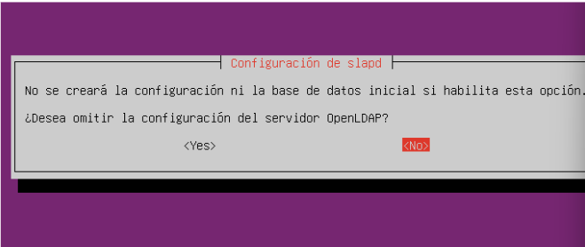

Introduïm:

- El nom del domini
- La contrasenya de l’administrador LDAP

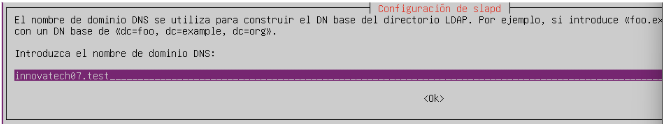
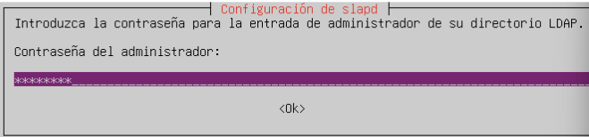

Indiquem que s’esborri el disc i es mogui la informació del directori.

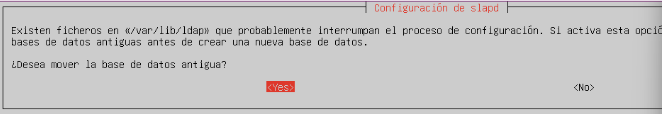

Comprovem que el directori ha estat modificat.

---

## 4. Creació de les Unitats Organitzatives (OU)

Entrem a l’arxiu OU.

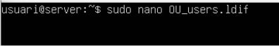

El modifiquem i creem dues OUs.

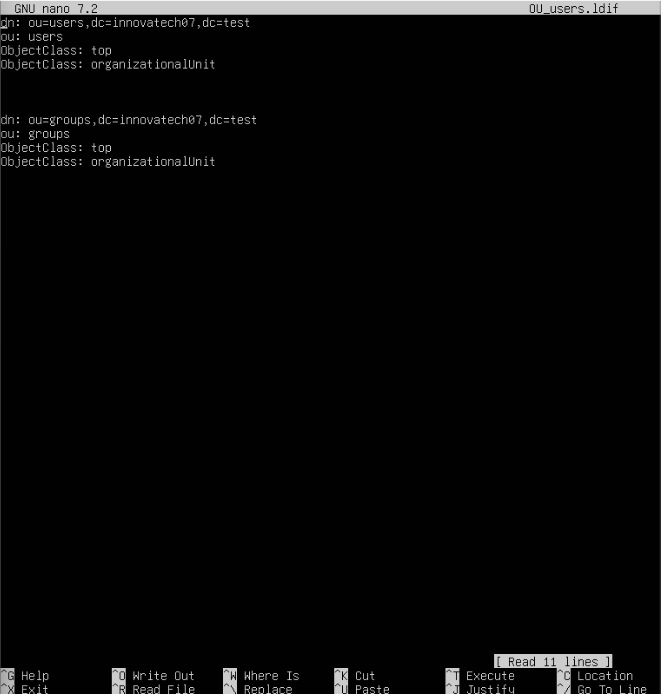

Afegim l’arxiu al directori amb la comanda corresponent.

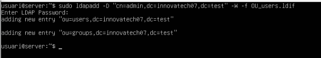

Comprovem totes les OUs creades.

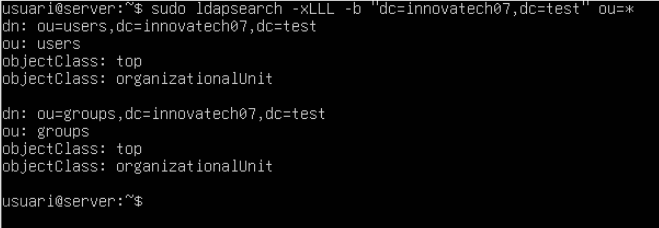

---

## 5. Instal·lació i configuració de LAM (LDAP Account Manager)

Instal·lem el gestor d’usuaris LDAP.

Accedim a LAM des del navegador utilitzant la IP del servidor:

`http://192.168.56.102/lam`

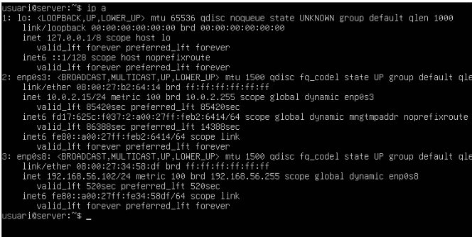

Entrem a la configuració de LAM.

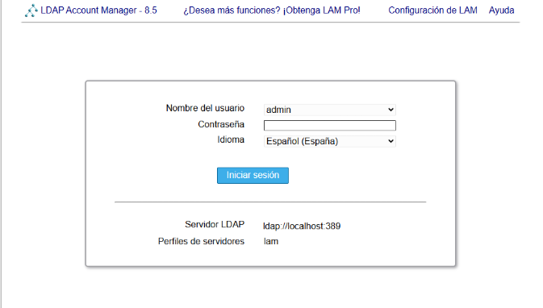

Editem el perfil del servidor.

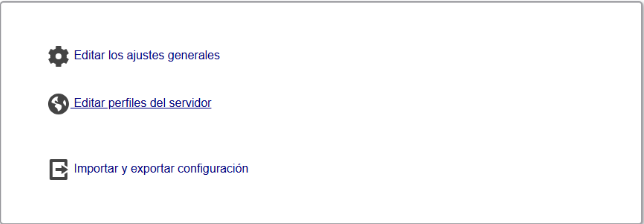

Ajustem els paràmetres del servidor LDAP:

- Contrasenya: `lam`

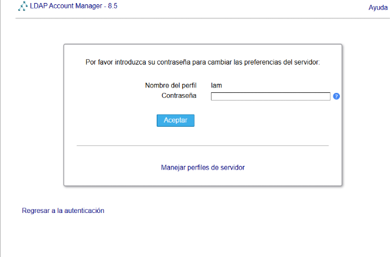

- Usuari admin: `cn=admin,dc=innovatech07,dc=test`

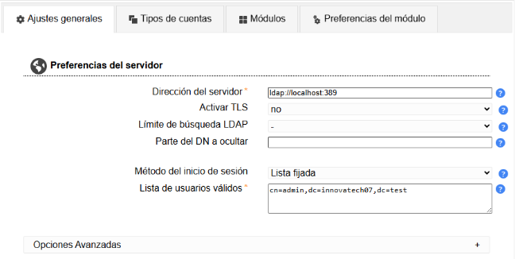

- Sufix de l’arbre: `dc=innovatech07,dc=test`

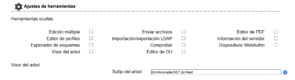

A “Account Types” definim els DN per usuaris i grups. Els tipus d’objectes ja venen per defecte.

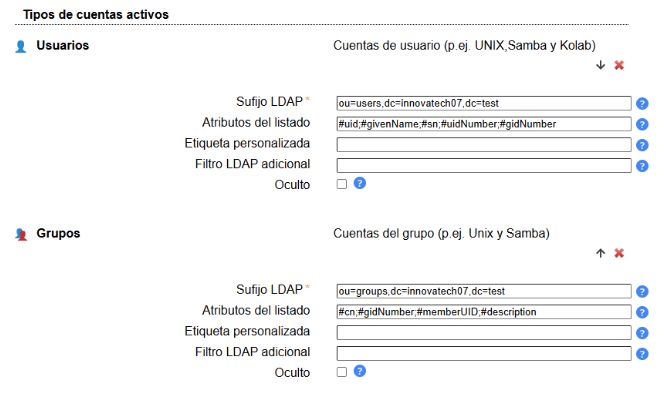

---

## 6. Creació d’usuaris

Per crear un usuari fem clic a “Nou usuari”:

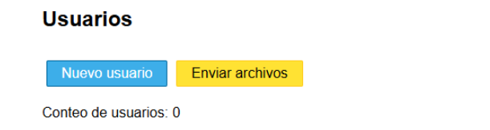

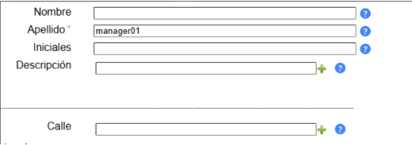

Marquem l’opció per crear un grup amb el mateix nom.

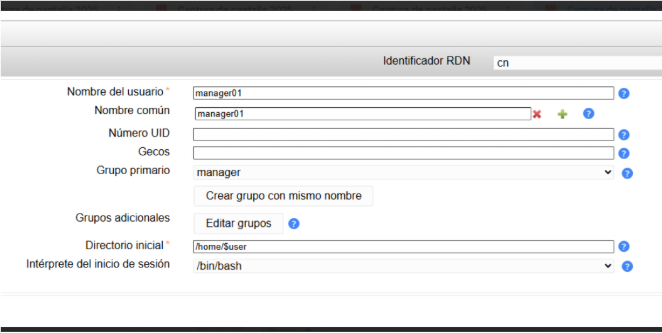

Repetim el procés per al segon usuari.

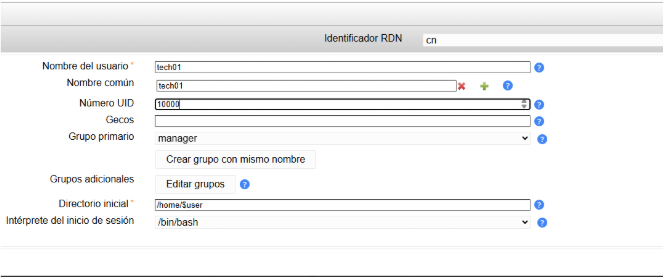

---

## 7. Creació de grups

Creem dos grups nous: **tech** i **manager**.

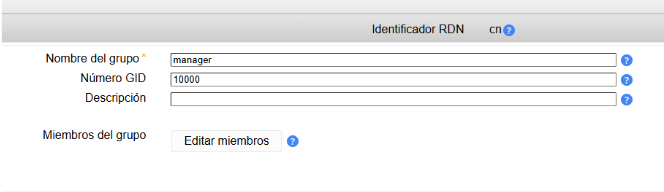

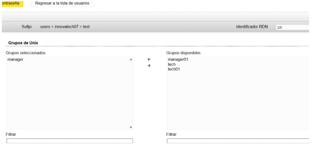

Assignem a cada usuari el seu grup secundari corresponent.

---

## 8. Configuració del client LDAP

Creem una nova màquina virtual amb:

- Primera interfície: **NAT**
- Segona interfície: **Només amfitrió**

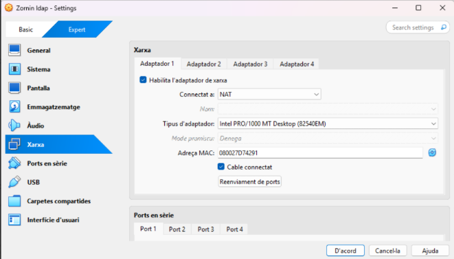

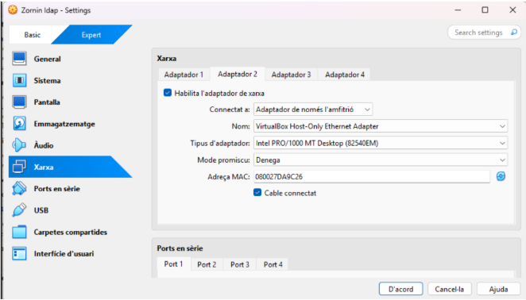

Editem `/etc/hosts` i afegim la IP i el nom del servidor.

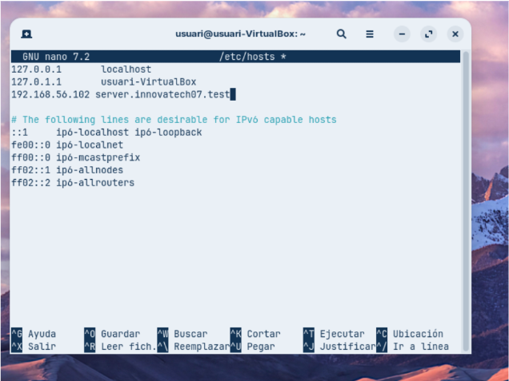

Instal·lem els mòduls necessaris per a l'autenticació LDAP.

A la configuració afegim:

- Identificador del servidor LDAP

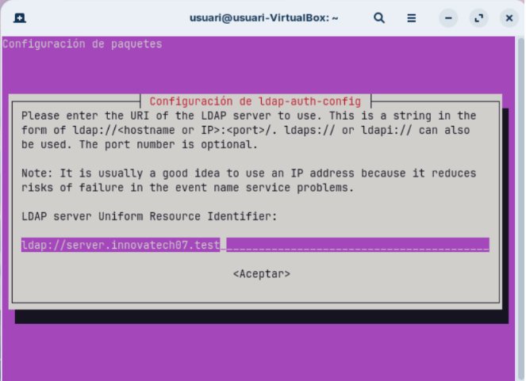

- Base de cerca

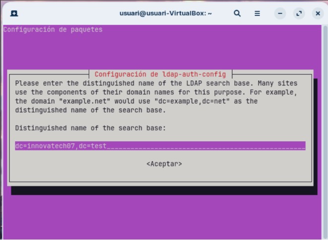

- Versió del protocol

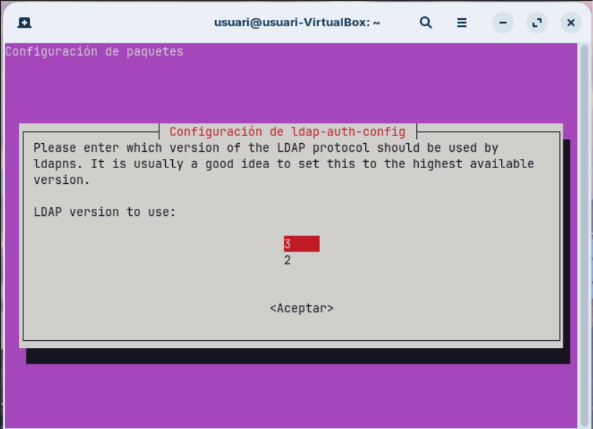

- Root com administrador

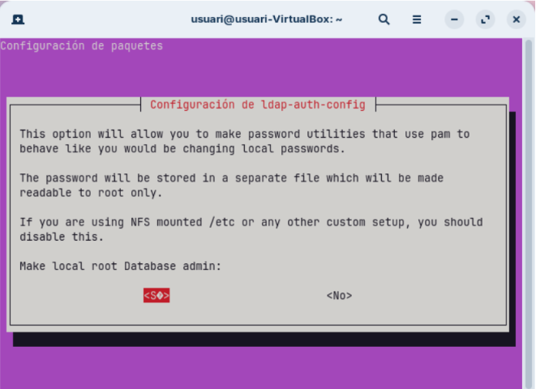

- Que no requereixi login

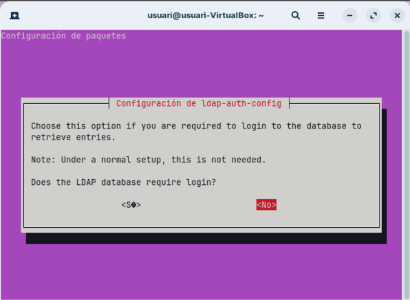

- Contrasenya LDAP

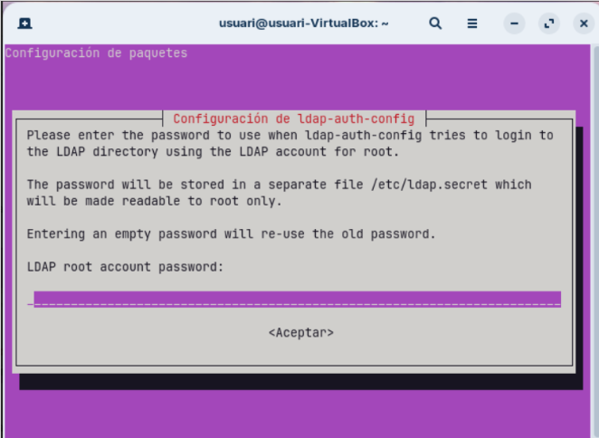

Comprovem la connectivitat amb el servidor.

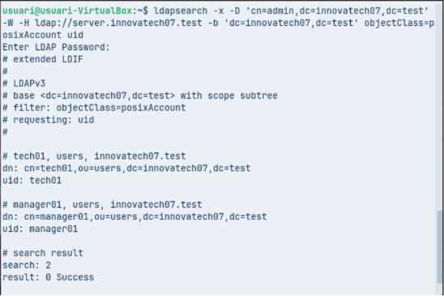

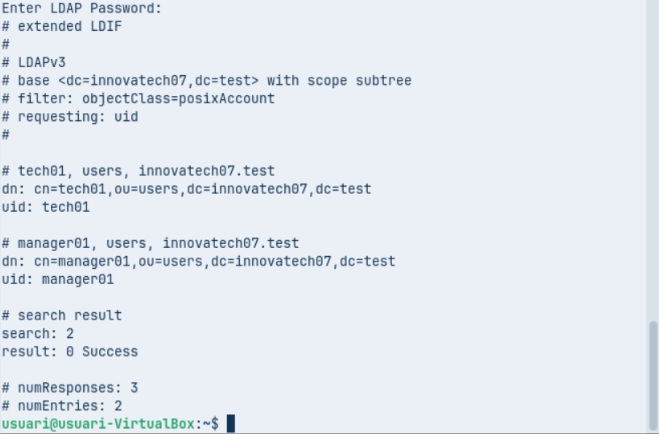

---

## 9. Modificació dels fitxers del sistema

Modifiquem `nsswitch.conf` perquè utilitzi LDAP per usuaris i grups.

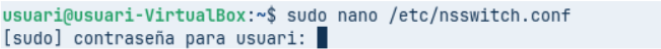

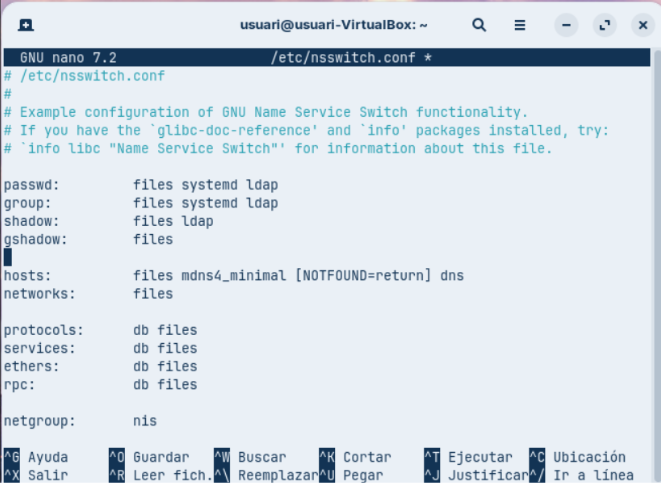

Modifiquem `common-password` i eliminem la línia `use_authtok`.

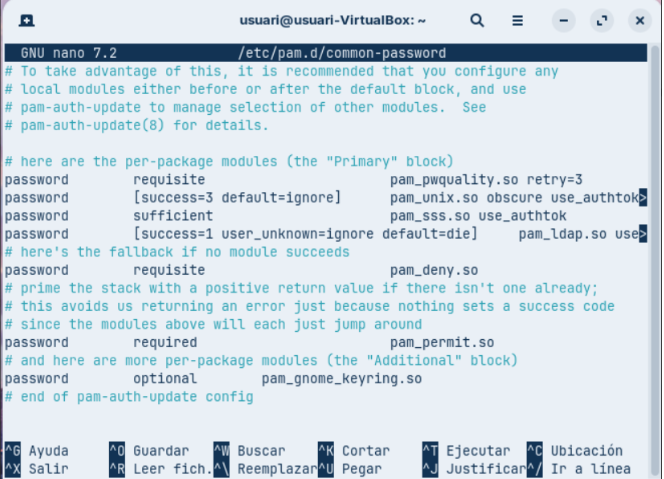

Afegim la línia PAM corresponent a `common-session`.

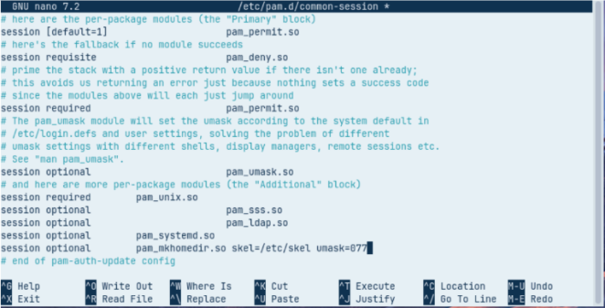

Reiniciem el sistema i comprovem que els usuaris LDAP són visibles amb la comanda:

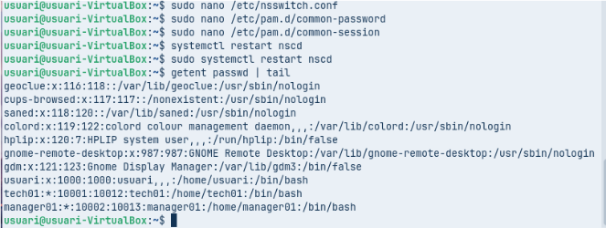

---

## 10. Activació de l'inici de sessió gràfic

Entrem a l’arxiu `gdm-launch-environment` per permetre l’inici de sessió gràfica.

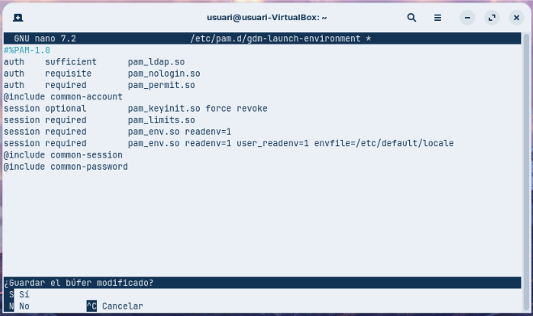

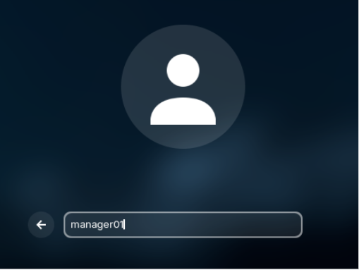

Reiniciem la màquina i iniciem sessió amb un usuari LDAP.

Comprovem que s’ha creat la seva carpeta personal.

---

# Fi del document
